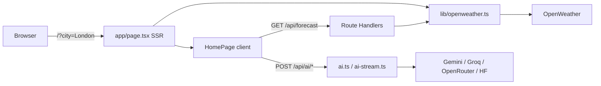

# AI-Powered Weather & Farming Advisory Dashboard - Next.js,React, TypeScript, OpenWeather API, Agro API, Unsplash API, TailwindCSS, Framer Motion Project

[](https://opensource.org/licenses/MIT)
[](https://nextjs.org/)
[](https://react.dev/)
[](https://www.typescriptlang.org/)
[](https://tailwindcss.com/)
[](https://www.framer.com/motion/)
[](https://nodejs.org/)
[](https://openweathermap.org/)
[](https://unsplash.com/)
[](https://agromonitoring.com/api)
[](https://sentry.io/)
[](https://diploi.com/launch/arnobt78/weather-app)

An **educational, full-stack style** weather application that goes beyond a simple temperature readout: it combines **live OpenWeather data**, **5-day forecast**, **air quality**, **dynamic Unsplash backgrounds**, **AI-generated weather summaries and farming tips** (via server API routes), optional **text-to-speech**, and a **glassmorphism UI** built with **Next.js App Router**, **React**, **TypeScript**, **Tailwind CSS**, and **Framer Motion**.

It is designed so you can **read the code**, **trace data from UI → Route Handler → external API**, and **reuse pieces** (hooks, UI primitives, context, lib helpers) in your own apps.

- **Live demo:** [https://weather-farming.vercel.app/](https://weather-farming.vercel.app/)
- **Security:** Private vulnerability reports → [SECURITY.md](./SECURITY.md) · [contact@arnobmahmud.com](mailto:contact@arnobmahmud.com)
- **Author:** [Arnob Mahmud](https://www.arnobmahmud.com/) | **LinkedIn:** [arnob-mahmud-05839655](https://www.linkedin.com/in/arnob-mahmud-05839655/) | **GitHub:** [arnobt78](https://github.com/arnobt78)


## Table of contents

1. [What you will learn](#what-you-will-learn)
2. [Features at a glance](#features-at-a-glance)
3. [Technology stack](#technology-stack)
4. [Dependencies & libraries (why they exist)](#dependencies--libraries-why-they-exist)
5. [Project structure](#project-structure)
6. [App routes & pages](#app-routes--pages)
7. [API routes (backend in Next.js)](#api-routes-backend-in-nextjs)
8. [How the app works (data flow walkthrough)](#how-the-app-works-data-flow-walkthrough)
9. [Core building blocks (beginner walkthrough)](#core-building-blocks-beginner-walkthrough)
10. [Environment variables (`.env`)](#environment-variables-env)
11. [How to get each API key](#how-to-get-each-api-key)
12. [Installation & how to run](#installation--how-to-run)
13. [Scripts you will use](#scripts-you-will-use)
14. [Security & production notes](#security--production-notes)
15. [Reusing components & patterns in other projects](#reusing-components--patterns-in-other-projects)
16. [Code snippets (illustrative)](#code-snippets-illustrative)
17. [Keywords](#keywords)
18. [Conclusion](#conclusion)
19. [License](#license)
20. [Happy Coding](#happy-coding)

---

## What you will learn

- How a **Next.js 16** app uses the **App Router** (`src/app/`), **Server Components** for initial data + SEO, and **Client Components** (`"use client"`) for interactivity.
- How to call **external REST APIs** safely: **server-only** keys live in **Route Handlers** (`src/app/api/.../route.ts`) and `src/lib/*` — never in the browser bundle.
- Why **`NEXT_PUBLIC_*`** variables are public (they ship to the client) and why weather/AI/Unsplash secrets must **not** use that prefix.
- How **React Context** (`WeatherProvider`) shares city, coordinates, saved cities, and current weather across Navbar, Home, Gallery, and background.
- How a custom hook (`useWeather`) manages **loading / ready / error** UI state for city search.
- How **Tailwind CSS** + small **UI primitives** (`Card`, `RippleButton`, `Input`, `SafeImage`, `Skeleton`) keep styling consistent.
- How **`SafeImage`** wraps **`next/image`** and falls back to a native **``** if optimization fails (for example Vercel Image Optimization **402**).
- How **Framer Motion** adds enter/exit animations without blocking data logic.
- How optional **AI fallbacks** work: Gemini → Groq → OpenRouter → Hugging Face (same model IDs for stream + JSON).
- How a coarse **in-memory rate limit** protects public AI routes, and how **`next.revalidate`** caches OpenWeather fetches (~300s).
- How **cookies** make last city / saved cities / background URL available on the **server** on the next request (SSR-friendly persistence without a database).

---

## Features at a glance

| Area                         | What it does                                                                                                           |
| ---------------------------- | ---------------------------------------------------------------------------------------------------------------------- |
| **City search**              | Navbar search navigates to `/?city=...`. Home loads weather for that city (SSR first, then client for other searches). |
| **Current weather**          | Temperature, feels-like, humidity, wind (**km/h**), pressure, visibility, sunrise/sunset, country, coordinates.        |
| **Weather visuals**          | OpenWeather icons + local PNG/GIF overlays by condition; glass-style hero cards.                                       |
| **5-day forecast**           | Aggregated daily view from OpenWeather 5-day / 3-hour API via `/api/forecast`.                                         |
| **Air quality**              | AQI + pollutants (PM2.5, PM10, O₃, NO₂, SO₂, CO, …) with short guide copy via `/api/air-quality`.                      |
| **AI weather summary**       | Button → `POST /api/ai/summary` → streamed `text/plain` or JSON `{ text }`.                                            |
| **AI farming tips**          | Button → `POST /api/ai/farming-tips` with weather + optional AQI/forecast/geo context.                                 |
| **TTS (optional)**           | `POST /api/ai/tts` — ElevenLabs if configured, else Edge TTS fallback.                                                 |
| **Panel errors**             | Forecast, AQI, AI, and TTS failures show a short message in the panel (no silent spinner).                             |
| **Backgrounds**              | Cookie URL wins; otherwise SSR calls `getInitialBackgroundUrl`; client can refresh via Unsplash.                       |
| **Gallery**                  | `/gallery` — paginated Unsplash grid keyed by weather-related keyword.                                                 |
| **Remote images**            | **`SafeImage`** — `next/image` first, native `` on optimizer error.                                               |
| **Persistence**              | City, saved cities (max 10), background URL via **cookies**; coordinates may use **localStorage**. No database.        |
| **SEO**                      | Rich `metadata` in `src/app/layout.tsx` (title, description, Open Graph, Twitter, canonical).                          |
| **Observability (optional)** | Sentry via `@sentry/nextjs`; browser events tunnel through same-origin `/api/monitoring`.                              |
| **Abuse limits**             | AI routes: ~10 POSTs / IP / 60s (in-memory per server instance) → `429`.                                               |

---

## Technology stack

| Layer         | Choice                                                                                    | Role                                                         |
| ------------- | ----------------------------------------------------------------------------------------- | ------------------------------------------------------------ |
| **Runtime**   | [Node.js](https://nodejs.org/) **24.x**                                                   | Engines pin in `package.json` / `.nvmrc`.                    |
| **Framework** | [Next.js](https://nextjs.org/) **16.3** (App Router)                                      | SSR/RSC, Route Handlers, image optimization, deploy.         |
| **UI**        | [React](https://react.dev/) **19.2**                                                      | Components, hooks, client islands.                           |
| **Language**  | [TypeScript](https://www.typescriptlang.org/) **5.9** (strict)                            | Typed OpenWeather / Unsplash / AI payloads in `src/types/*`. |
| **Styling**   | [Tailwind CSS](https://tailwindcss.com/) **3.4**                                          | Utility-first layout + glass tokens.                         |
| **Animation** | [Framer Motion](https://www.framer.com/motion/) **12**                                    | Motion / AnimatePresence / stagger.                          |
| **Icons**     | [Lucide React](https://lucide.dev/)                                                       | Tree-shakeable SVG icons.                                    |
| **Weather**   | [OpenWeather](https://openweathermap.org/) Current + Forecast + Air Pollution + Geocoding | Server-only via `lib/openweather.ts`.                        |
| **Images**    | [Unsplash](https://unsplash.com/developers) + `next/image`                                | Backgrounds + gallery; **`SafeImage`** fallback.             |
| **AI**        | Gemini / Groq / OpenRouter / optional Hugging Face                                        | Server prompts in `lib/ai.ts` + `lib/ai-stream.ts`.          |
| **TTS**       | ElevenLabs (optional) + Edge TTS                                                          | `lib/tts.ts` + `/api/ai/tts`.                                |
| **Errors**    | [Sentry](https://sentry.io/) (`@sentry/nextjs`, optional)                                 | Client + server; tunnel `/api/monitoring`.                   |
| **Deploy**    | [Vercel](https://vercel.com/)                                                             | `vercel.json` headers; live demo link above.                 |
| **Quality**   | ESLint + `tsc --noEmit` + Node `node:test`                                                | `npm run lint` · `typecheck` · `test` · `build`.             |

> **Note:** There is **no** Redis, database, JWT auth, or Vite in this product. Persistence is cookies + localStorage. Agro API key is **reserved** in `.env.example` for future extension — not wired in UI yet.

---

## Dependencies & libraries (why they exist)

### Runtime (`dependencies`)

| Package                    | What it is                 | How this project uses it                                                                 |
| -------------------------- | -------------------------- | ---------------------------------------------------------------------------------------- |
| `next`                     | Full-stack React framework | App Router pages, layouts, Route Handlers, `next/image`, build/deploy.                   |
| `react` / `react-dom`      | UI library                 | Components, hooks, client islands (`HomePage`, `Navbar`, …).                             |
| `framer-motion`            | Animation library          | Card fades, list stagger, presence on dashboard sections.                                |
| `lucide-react`             | Icon set                   | `Wind`, `Droplets`, `Leaf`, `Volume2`, etc.                                              |
| `clsx` + `tailwind-merge`  | Class-name helpers         | Combined in `cn()` (`src/lib/utils.ts`) so conditional Tailwind classes do not conflict. |
| `class-variance-authority` | Variant API for components | Clean “button has visual variants” without string soup.                                  |
| `edge-tts-universal`       | Free TTS backend           | Fallback when ElevenLabs is missing/fails.                                               |
| `@sentry/nextjs`           | Error monitoring           | Optional DSN; tunnel rewrite so ad blockers do not drop events.                          |

### Dev (`devDependencies`)

| Package                                    | Role                                                  |
| ------------------------------------------ | ----------------------------------------------------- |
| `typescript` + `@types/*`                  | Strict typing                                         |
| `tailwindcss` + `postcss` + `autoprefixer` | CSS pipeline                                          |
| `eslint` + `eslint-config-next`            | Lint (`npm run lint`)                                 |
| `tsx`                                      | Run TypeScript tests with Node’s built-in test runner |

---

## Project structure

High-level map (most paths under `src/`):

```bash
weather-farming/
├── public/                       # favicon, weather PNGs, GIFs
├── src/
│   ├── app/
│   │   ├── layout.tsx            # SEO metadata, fonts, cookies → providers, shell
│   │   ├── page.tsx              # Home SSR: resolve city → fetch weather → HomePage
│   │   ├── globals.css           # Global styles / utilities
│   │   ├── robots.ts             # Disallow /api/ for crawlers
│   │   ├── global-error.tsx      # Root error UI (+ Sentry when enabled)
│   │   ├── gallery/page.tsx      # Gallery route shell
│   │   └── api/                  # “Backend” = Route Handlers
│   │       ├── weather/route.ts
│   │       ├── geocode/route.ts
│   │       ├── forecast/route.ts
│   │       ├── air-quality/route.ts
│   │       ├── unsplash/route.ts
│   │       └── ai/
│   │           ├── summary/route.ts
│   │           ├── farming-tips/route.ts
│   │           └── tts/route.ts
│   ├── Components/
│   │   ├── pages/                # home-page.tsx, gallery-page.tsx (client islands)
│   │   ├── shared/               # Navbar, Footer, WeatherBackground, preload
│   │   └── ui/                   # Card, Input, Badge, Skeleton, RippleButton, SafeImage, …
│   ├── context/WeatherContext.tsx
│   ├── hooks/useWeather.ts
│   ├── lib/                      # Server helpers + shared utils
│   │   ├── openweather.ts        # OpenWeather fetch + 300s revalidate
│   │   ├── unsplash.ts / background.ts
│   │   ├── ai.ts / ai-stream.ts / ai-providers.ts
│   │   ├── ai-validate.ts        # POST body guards (no Zod)
│   │   ├── ai-rate-limit.ts      # In-memory 10/IP/min
│   │   ├── units.ts              # ms → km/h
│   │   ├── tts.ts / utils.ts / sentry-*
│   │   └── *.test.ts             # Node tests
│   ├── types/                    # weather, forecast, air, geo, unsplash
│   ├── data/constants.ts         # DEFAULT_CITY, cookie keys, weather→asset maps
│   ├── provider/app-provider.tsx
│   ├── instrumentation.ts        # Sentry server init hook
│   └── instrumentation-client.ts # Sentry client + tunnel
├── .env.example                  # Template (copy → .env.local)
├── SECURITY.md                   # Private vulnerability reporting
├── next.config.ts
├── vercel.json
├── package.json
└── README.md
```

---

## App routes & pages

| Route             | File(s)                                           | Purpose                                          |
| ----------------- | ------------------------------------------------- | ------------------------------------------------ |
| **`/`**           | `app/page.tsx` + `Components/pages/home-page.tsx` | Main dashboard: weather, forecast, AQI, AI, TTS. |
| **`/gallery`**    | `app/gallery/page.tsx` + `gallery-page.tsx`       | Unsplash photo grid by weather keyword.          |
| **`/robots.txt`** | `app/robots.ts`                                   | SEO robots; disallows `/api/`.                   |
| **404**           | Next.js default                                   | Not-found handling.                              |

**City resolution order on `/` (server):**

1. URL query `?city=`
2. Cookie `weather-live-city`
3. Default city **`Frankfurt`** (`DEFAULT_CITY` in `data/constants.ts`)

---

## API routes (backend in Next.js)

These run **only on the server**. The browser calls **your origin** (`/api/...`). Secret keys never leave the server.

| Method | Path                           | Role                                                 | Typical status codes              |
| ------ | ------------------------------ | ---------------------------------------------------- | --------------------------------- |
| `GET`  | `/api/weather?city=`           | Current weather proxy                                | 200 JSON · 400 · 502              |
| `GET`  | `/api/geocode?city=`           | Lat/lon fallback when weather payload has no `coord` | 200 · 400 · 502                   |
| `GET`  | `/api/forecast?lat=&lon=`      | 5-day / 3-hour forecast                              | 200 · 400 · 502                   |
| `GET`  | `/api/air-quality?lat=&lon=`   | Air pollution                                        | 200 · 400 · 502                   |
| `GET`  | `/api/unsplash?keyword=&page=` | Unsplash search JSON                                 | 200 (may be empty without key)    |
| `POST` | `/api/ai/summary`              | Short weather summary (+ outfit hint)                | 200 stream/JSON · 400 · 429 · 503 |
| `POST` | `/api/ai/farming-tips`         | Long-form farming tips                               | 200 · 400 · 429 · 503             |
| `POST` | `/api/ai/tts`                  | Text → `audio/mpeg`                                  | 200 audio · 400 · 429 · 503       |

**AI request shape (summary) — educational example:**

```json
{
  "city": "London",
  "weather": {
    "temp": 18,
    "humidity": 62,
    "wind": 14.4,
    "main": "Clouds",
    "description": "scattered clouds"
  }
}
```

- Missing `city` → `{ "error": "city required" }` (**400**)
- Missing/invalid `weather` → `{ "error": "weather required" }` (**400**)
- Too many POSTs from one IP → `{ "error": "Too many requests" }` (**429**)

**Wind units:** OpenWeather `units=metric` returns wind in **m/s**. The UI and AI payloads convert with `msToKmh()` so labels that say **km/h** are truthful.

---

## How the app works (data flow walkthrough)

1. **First load of `/`**
   - `layout.tsx` (Server Component) reads cookies (city, saved cities, optional background URL).
   - If there is **no** background cookie: fetch cached weather → `getInitialBackgroundUrl(main)` inside try/catch → `null` on failure (page never blanks).
   - `page.tsx` resolves city, calls `fetchWeatherByCity` (OpenWeather, **300s** revalidate cache), passes `initialData` into client `HomePage`.

2. **Client hydration**
   - `WeatherProvider` gets initial city / saved list from the layout so Navbar and Home stay in sync.
   - `HomePage` uses `useWeather(initialData)` + `useSearchParams`.
   - If `?city=` matches SSR city name → **no duplicate** current-weather fetch.
   - If SSR weather is missing → error card: **Weather unavailable.** (not an infinite skeleton).
   - Failed search for another city → **City not found.**

3. **After weather is ready**
   - Coordinates from `weather.coord` (preferred) or `/api/geocode` fallback.
   - `useEffect` loads `/api/forecast` and `/api/air-quality`. Failures set panel error strings.

4. **AI buttons**
   - Client POSTs JSON to `/api/ai/summary` or `/api/ai/farming-tips`.
   - Server: rate limit → validate body → build prompt → stream or JSON via Gemini → Groq → OpenRouter → optional HF.
   - Errors surface in tinted panel boxes (sky / emerald / violet).

5. **TTS**
   - Combines summary + tips text → `/api/ai/tts` → play audio in the browser.

6. **Background / gallery**
   - `WeatherBackground` can refresh Unsplash client-side via `/api/unsplash`.
   - Gallery paginates the same proxy.



---

## Core building blocks (beginner walkthrough)

| Piece                  | File                             | Beginner takeaway                                                                                               |
| ---------------------- | -------------------------------- | --------------------------------------------------------------------------------------------------------------- |
| **Root layout**        | `app/layout.tsx`                 | One shell for every page: fonts, metadata, Navbar, Footer, background, providers. Stays a **Server Component**. |
| **Home page (server)** | `app/page.tsx`                   | Fetches weather on the server for first paint + SEO.                                                            |
| **Home page (client)** | `Components/pages/home-page.tsx` | Interactive dashboard: search effects, forecast/AQI, AI buttons, TTS.                                           |
| **Weather context**    | `context/WeatherContext.tsx`     | Global “session” state without Redux: city, coords, saved cities, current weather.                              |
| **useWeather**         | `hooks/useWeather.ts`            | Encapsulates fetch + `loading \| ready \| error` discriminated union.                                           |
| **OpenWeather lib**    | `lib/openweather.ts`             | **Server-only.** Never import from client components — use `/api/weather` instead.                              |
| **AI registry**        | `lib/ai-providers.ts`            | Single place for model IDs used by both stream and JSON paths.                                                  |
| **Validation**         | `lib/ai-validate.ts`             | Lightweight TypeScript guards (no Zod dependency).                                                              |
| **Units**              | `lib/units.ts`                   | `msToKmh(10)` → `36` (one decimal precision helper).                                                            |
| **SafeImage**          | `Components/ui/safe-image.tsx`   | Production-hardened remote images.                                                                              |
| **Constants**          | `data/constants.ts`              | Cookie keys + weather → image/GIF/Unsplash query maps — tweak mood without rewriting UI.                        |

---

## Environment variables (`.env`)

There is **no** committed `.env` or `.env.local` (secrets stay on your machine / Vercel).

**Minimum to see real weather:** set `OPENWEATHER_API_KEY`.

**You can run `npm run dev` without any keys** — the app still builds and renders — but weather, AI, Unsplash, and TTS features will degrade or show panel errors until keys are set. Treat other keys as **optional enhancements**.

### Setup

```bash
cp .env.example .env.local
# Edit .env.local with your keys
```

Next.js automatically loads `.env.local` in development and build. On Vercel, add the **same names** under Project → Settings → Environment Variables.

### Variable reference

| Variable                                              | Required?                | Purpose                                                                                 |
| ----------------------------------------------------- | ------------------------ | --------------------------------------------------------------------------------------- |
| `OPENWEATHER_API_KEY`                                 | **Yes** for live weather | Server-only. SSR + `/api/weather`, `/api/geocode`, `/api/forecast`, `/api/air-quality`. |
| `NEXT_PUBLIC_APP_TITLE`                               | Optional                 | Overrides default document title segment.                                               |
| `NEXT_PUBLIC_SITE_URL`                                | Optional                 | Canonical / Open Graph base (no trailing slash).                                        |
| `UNSPLASH_ACCESS_KEY`                                 | Optional                 | Dynamic backgrounds + gallery.                                                          |
| `GOOGLE_GEMINI_API_KEY`                               | Optional (AI)            | First AI provider (Gemini 2.5 Flash / Flash-Lite).                                      |
| `GROQ_API_KEY`                                        | Optional (AI)            | Second fallback.                                                                        |
| `OPENROUTER_API_KEY`                                  | Optional (AI)            | Third fallback (`:free` models).                                                        |
| `HUGGINGFACE_API_KEY` or `HF_TOKEN`                   | Optional (AI)            | Last fallback via HF router.                                                            |
| `AGRO_API_KEY`                                        | Optional / reserved      | Placeholder for future Agro Monitoring integration (not used in UI yet).                |
| `ELEVENLABS_API_KEY`                                  | Optional                 | Premium TTS; Edge TTS is free fallback.                                                 |
| `NEXT_PUBLIC_SENTRY_DSN`                              | Optional                 | Browser DSN; empty disables Sentry.                                                     |
| `SENTRY_DSN`                                          | Optional                 | Server alias (falls back to public DSN).                                                |
| `SENTRY_ORG` / `SENTRY_PROJECT` / `SENTRY_AUTH_TOKEN` | Optional (CI)            | Source-map upload on deploy.                                                            |

**Never** put OpenWeather / AI / Unsplash secrets in `NEXT_PUBLIC_*` — that would expose them in the client JavaScript bundle.

---

## How to get each API key

1. **OpenWeather (required for weather)**
   - Sign up: [openweathermap.org/api](https://openweathermap.org/api)
   - Create an API key (new keys can take a few minutes to activate).
   - Paste into `OPENWEATHER_API_KEY`.

2. **Unsplash (backgrounds + gallery)**
   - [unsplash.com/developers](https://unsplash.com/developers) → create an app → **Access Key** → `UNSPLASH_ACCESS_KEY`.

3. **Google Gemini (AI)**
   - [aistudio.google.com](https://aistudio.google.com/) → API key → `GOOGLE_GEMINI_API_KEY`.

4. **Groq (AI fallback)**
   - [console.groq.com](https://console.groq.com/) → API keys → `GROQ_API_KEY`.

5. **OpenRouter (AI fallback)**
   - [openrouter.ai](https://openrouter.ai/) → keys → `OPENROUTER_API_KEY`.

6. **Hugging Face (optional last AI rung)**
   - [huggingface.co/settings/tokens](https://huggingface.co/settings/tokens) → `HUGGINGFACE_API_KEY`.

7. **ElevenLabs (optional TTS)**
   - [elevenlabs.io](https://elevenlabs.io/) → API key → `ELEVENLABS_API_KEY`. Without it, Edge TTS may still work.

8. **Sentry (optional errors)**
   - [sentry.io](https://sentry.io/) → Project → Client Keys (DSN) → `NEXT_PUBLIC_SENTRY_DSN`.
   - Empty DSN = Sentry off. Browser events POST to `/api/monitoring` (same origin).

---

## Installation & how to run

**Prerequisites:** Node.js **24.x** (see `.nvmrc`), npm.

```bash
git clone https://github.com/arnobt78/weather-app.git
cd weather-app
npm install
cp .env.example .env.local
# Edit .env.local — at minimum set OPENWEATHER_API_KEY for live weather
npm run dev
```

Open [http://localhost:3000](http://localhost:3000).

**Try these learning paths:**

1. Load `/` → inspect Network for SSR HTML, then client calls to `/api/forecast` and `/api/air-quality`.
2. Search a city in the Navbar → watch `/?city=...` and `/api/weather`.
3. Click **AI Weather Summary** with at least one AI key set → watch streamed text.
4. Open `/gallery` with Unsplash configured → pagination via `/api/unsplash`.

**Deploy:** push to GitHub and import on [Vercel](https://vercel.com/). Mirror env vars from `.env.example`. Optional one-click style launch: [Diploi](https://diploi.com/launch/arnobt78/weather-app).

---

## Scripts you will use

| Script    | Command             | Description                                          |
| --------- | ------------------- | ---------------------------------------------------- |
| Dev       | `npm run dev`       | Next.js development server.                          |
| Build     | `npm run build`     | Production build (includes TypeScript check).        |
| Start     | `npm run start`     | Serve the production build.                          |
| Lint      | `npm run lint`      | ESLint across the repo.                              |
| Typecheck | `npm run typecheck` | `tsc --noEmit`.                                      |
| Test      | `npm test`          | Node built-in tests (`src/lib/*.test.ts`) via `tsx`. |

---

## Security & production notes

- Report vulnerabilities **privately** — see [SECURITY.md](./SECURITY.md) ([contact@arnobmahmud.com](mailto:contact@arnobmahmud.com)). Do not file public issues for security findings.
- `app/robots.ts` disallows crawling `/api/`.
- Response security headers are set via `next.config.ts` / `vercel.json` (nosniff, frame deny, referrer, permissions policy).
- AI routes have a **coarse** per-instance IP rate limit (not a global Redis quota).
- OpenWeather responses are cached with **`next: { revalidate: 300 }`** to reduce quota burn.
- Recommended on Vercel: enable Firewall Bot Protection (dashboard setting; not expressible only in repo files).

---

## Reusing components & patterns in other projects

| Piece                                                | How to reuse                                                                                                          |
| ---------------------------------------------------- | --------------------------------------------------------------------------------------------------------------------- |
| **`WeatherProvider` + `useWeatherContext`**          | Pattern for any “global session” state (locale, theme, cart) with SSR cookie hydration.                               |
| **`useWeather`**                                     | Template for `useState` + `useCallback` + fetch + error messaging.                                                    |
| **`Components/ui/*`**                                | Copy `Card`, `Input`, `RippleButton`, `Skeleton`, `Badge` into another Tailwind app; keep `cn()` from `lib/utils.ts`. |
| **`SafeImage`**                                      | Any app that uses `next/image` with remote URLs and needs a native `` fallback.                                  |
| **Route Handlers**                                   | Pattern: validate query/body → call `lib/*` → `NextResponse.json` / stream.                                           |
| **`lib/openweather.ts`**                             | Single module for all OpenWeather URLs + types; extend with One Call / maps.                                          |
| **`lib/ai-providers.ts` + `ai.ts` / `ai-stream.ts`** | Multi-provider fallback chain you can port to other AI features.                                                      |
| **`ai-validate.ts` / `ai-rate-limit.ts`**            | Small, dependency-free guards and abuse limits for public POSTs.                                                      |
| **`layout.tsx` metadata**                            | SEO template for marketing or dashboard sites.                                                                        |
| **Cookie keys in `constants.ts`**                    | Teach “SSR-readable persistence” without a database.                                                                  |

---

## Code snippets (illustrative)

**Server fetch in a page (concept):**

```ts
// src/app/page.tsx — simplified idea
const initialData =
  (await fetchWeatherByCity(initialCity)) ??
  (initialCity !== DEFAULT_CITY
    ? await fetchWeatherByCity(DEFAULT_CITY)
    : null);

return <HomePage key={initialCity} initialData={initialData} />;
```

**Client calling your own API (never put the secret key here):**

```ts
const res = await fetch(`/api/weather?city=${encodeURIComponent(city)}`);
if (!res.ok) {
  // show panel / card error
  return;
}
const data = await res.json();
```

**Wind conversion so UI labels stay honest:**

```ts
import { msToKmh } from "@/lib/units";

// OpenWeather metric wind.speed is m/s
const windKmh = msToKmh(state.data.wind.speed); // e.g. 10 → 36
```

**Safe Tailwind class merging:**

```ts
import { cn } from "@/lib/utils";

<div className={cn("p-4 rounded-xl", isActive && "bg-sky-500/20")} />
```

**AI rate-limit + validation order (server):**

```ts
const limited = enforceAiRateLimit(request);
if (limited) return limited; // 429

const parsed = validateSummaryBody(await request.json());
if (!parsed.ok) {
  return NextResponse.json({ error: parsed.error }, { status: 400 });
}
```

---

## Keywords

Next.js, React, TypeScript, App Router, Server Components, Client Components, Route Handlers, OpenWeather API, forecast, air quality, AQI, Unsplash, next/image, SafeImage, Tailwind CSS, Framer Motion, Lucide, glassmorphism, AI weather summary, farming advisory, Gemini, Groq, OpenRouter, Hugging Face, Edge TTS, ElevenLabs, Sentry, cookies, localStorage, SSR, ISR-style revalidate, rate limit, educational project, Vercel, Arnob Mahmud

---

## Conclusion

**AI-Powered Weather & Farming Advisory Dashboard** is a practical playground for modern React and Next.js: typed external APIs, clear server/client boundaries, optional AI and observability, and a polished UI — without requiring a database or auth stack.

**Suggested learning order:**

1. Trace **search city** → `/?city=` → SSR `page.tsx` → `HomePage` / `useWeather` → `/api/weather`.
2. Trace **forecast / AQI** from coordinates → Route Handlers → panel UI + error states.
3. Trace **AI summary** → validation → provider fallback → stream in the UI.
4. Copy one UI primitive or one Route Handler into a fresh Next.js app and adapt it.

Extend with your own card, prompt, or data source when you are ready — the architecture is intentionally readable.

---

## License

This project is licensed under the [MIT License](https://opensource.org/licenses/MIT). Feel free to use, modify, and distribute the code as per the terms of the license.

---

## Happy Coding! 🎉

This is an **open-source project** - feel free to use, enhance, and extend this project further!

If you have any questions or want to share your work, reach out via GitHub or my portfolio at [https://www.arnobmahmud.com](https://www.arnobmahmud.com).

**Enjoy building and learning!** 🚀

Thank you! 😊
